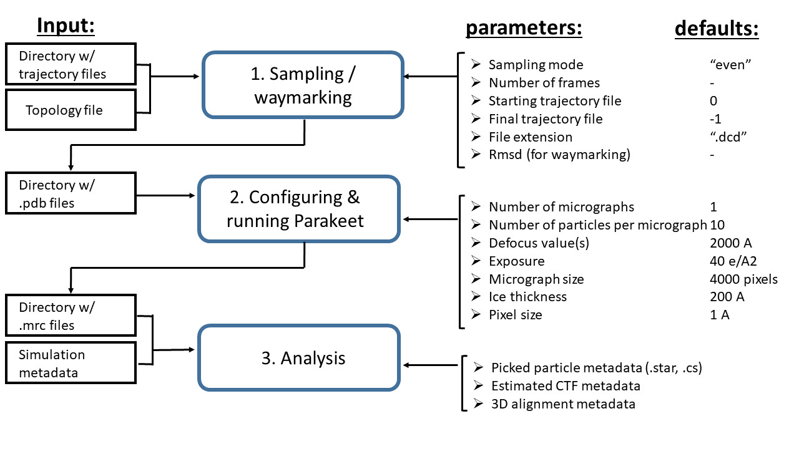

# Roodmus
Roodmus is a benchmarking tool that allows for the analysis of cryo-EM reconstruction methods using ground truth data. Roodmus uses a molecular dynamics (MD) trajectory as input and samples this trajectory to generate a data set with encoded heterogeneity as defined by the MD. Synthetic micrographs are generated in the package using the Parakeet simulation software (github.com/rosalindfranklininstitute/parakeet). This data can then be processed using either RELION (https://relion.readthedocs.io/en/release-4.0/) or cryoSPARC (https://cryosparc.com/) to generate a reconstruction. Roodmus provides several tools to analyse various steps in the reconstruction pipeline including:
- Comparing the estimated defocus values to the ground truth CTF parameters
- Computing precision and recall of particle picking by comparing the picked particles to the ground truth particle positions
- Comparing the estimated particle orientations to the ground truth particle orientations
- Computing precision for 2D classes
- Analysis of the distribution of the MD trajectory over 3D classes

WIP analysis tools:
- analysis of latent spaces of heterogeneous reconstruction methods (CryoDRGN, cryoSPARC 3DFlex)
- comparing the MD trajectory to a latent space


## How to use Roodmus
The aim of roodmus is to turn an MD trajectory into a set of micrographs that can serve as ground-truth for testing cryo-EM (heterogeneous) reconstruction methods. The core of the micrograph simulation is done using parakeet. The program consists of three modules: 

### 1. Sample pdb/mmcif models from trajectory dataset
Given a directory of trajectory files (in for example .nc or .dcd format) and a topology file (for example a .pdb file), this module saves a selection of frames from the trajectory as .pdb files. The general command used to run this module is:
```
roodmus conformations_sampling --trajfiles_dir_path PATH/TO/DCD/FILES --topfile_path PATH/TO/TOPOLOGY.pdb --n_conformations N --output_dir_path PATH/TO/OUTPUT/DIR
```
Where N is the number of conformations to be samples from the trajectory. In case N is larger than the number of frames in the trajectory, N will be set equal to the number of frames.

Sampling can be done either evenly or by waymarking. In case of even sampling, frames of the trajectory will be sampled at even intervals. In case of waymarking, a random starting point is selected and new frames are sampled if their rmsd with respect to the sampled frames is larger than a given threshold. The general command used to run conformation sampling in waymarking mode is:
```
roodmus conformations_sampling --trajfiles_dir_path PATH/TO/DCD/FILES --topfile_path PATH/TO/TOPOLOGY.pdb --n_conformations N --output_dir_path PATH/TO/OUTPUT/DIR --rmsd Threshold --sampling_method waymark
```
Where Threshold is the rmsd threshold for sampling a new frame and SEED is the seed for the random starting point. The default value for Threshold is 0.3. More options are availble, see the help page for more information.

Sampled conformations are saved as individual .pdb files in the output directory.


### 2. Generate SPA dataset using Parakeet python API:
Given a directory containing (any) .pdb files, a desired number of images to simulate and a number of molecules per image, this module generates a configuration file to run parakeet and then executes the parakeet simulation. Each micrograph subsamples the .pdb files to the number of molecules to generate, if not enough .pdb files are available, multiple instances of the same file are used. The config file is saved as a .yaml file with the same name as the image it corresponds to. The general command for this module is:
```
roodmus run_parakeet --pdb_dir PATH/TO/PDB/FILES --mrc_dir PATH/TO/OUTPUT/DIR -n N -m M --device "gpu or cpu" 
```
Where N is the number of images to generate and M is the number of molecules per image. There are many more options available for configuring the parakeet simulation. Most have been set to reasonable defaults, but can be changed if desired. See the help page for more information. A list of the most important configuration options:
- --acceleration_voltage: acceleration voltage in kV. Default: 300
- --electrons_per_angstrom: total exposure in electrons per Angstrom. Default: 45
- --dqe: detector quantum efficiency. Uses Parakeet's detector quantum efficiency model. Boolean
- -- pixel_size: pixel size in Angstrom. Default: 1.0
- --c_10: defocus value. Can be a single value or a range. If a range is passed, each micrograph with use the next value in the range, cycling back to the first value after the last.
- --c_10_stddev: standard deviation of the defocus value. Can be a single value or a range. If a range is passed, is must be the same length as the range passed to c_10
- --box_{x, y, z}: size of the box containing the molecules in Angstrom. Default: 1000 in x, y direction. 500 in z direction.
- --centre_{x, y, z}: centre of the box containing the molecules in Angstrom. Default: 500 in x, y direction. 250 in z direction.


### 3. Tools to visualise and investigate truth particles 
This module contains various tools to analyse a reconstruction done with the synthetic data generated. In general, in order to perform the analysis, the ground truth configuration files (.yaml) need to be supplied as well as one or several metadata files from the reconstruction pipeline. These metadata files can either be .star files from RELION or .cs files from cryoSPARC. 

The first functionality is comparing estimated CTF parameters to the parameters used to create the synthetic data. This can be done using the following command:
```
roodmus plot_ctf --config_dir PATH/TO/CONFIG/FILES --mrc_dir PATH/TO/MRC/FILES --metadata_file PATH/TO/METADATA/FILE.{star, cs} --plot_dir PATH/TO/PLOT/DIR -N N --plot_types {scatter, ctf}
```
Where N is the number of micrographs to load and --mrc_dir is the directory containing .mrc micrograph files. The 'scatter' plot type plots the estimated defocus values vs. true defocus for each particle. The 'ctf' plot type plots the CTF in the style of CTFFind4 for the first N micrographs, for both estimated and true defocus parameters.

The second functionality is comparing picked particle positions and true particle positions. This can be done using the following command:
```
roodmus plot_picking --config_dir PATH/TO/CONFIG/FILES --mrc_dir PATH/TO/MRC/FILES --metadata_file PATH/TO/METADATA/FILE.{star, cs} --job_types "particle picking" "2D classification" "..." --plot_dir PATH/TO/PLOT/DIR -N N --plot_types {label_truth, label_picked, label_truth_and_picked, precision, boundary, overlap} --particle_diamter D
```
Where N is the number of micrographs to load and --mrc_dir is the directory containing .mrc micrograph files. Multiple metadata files can be loaded in at the same time. Each metadata file can be given a label using the job_types option. metadata files with the same label are grouped together. The labels are used as titles and axis labels in plots. D is the particle diamter in angstroms.
The 'label_truth' plot type plots the true particle positions on the micrograph for each metadata_file supplied. The 'label_picked' plot type plots the picked particle positions on the micrograph. The 'label_truth_and_picked' plot type plots both the true and picked particle positions on the micrograph. The 'precision' plot type plots the particle picking precision and recall for each job_type. Precision is defined as the number of picked particles closer than particle_diameter/2 to any true particle divided by the total number of picked particles. Recall is defined as the number of true particles with at least one picked particle closer than particle_diameter/2 divided by the total number of true particles.
The 'boundary' plot type plots the distribution of particles in the micrographs in x-, y- and z-direction. The 'overlap' plot type plots the number of picked particles closer than r to any true particle for a range of r values.

Other functionality includes comparing estimated particle orientations to true particle orientations and plotting precision for 2D classes. See the help page for more information:
```
roodmus --help
```
or
```
roodmus {plot_picking, plot_ctf, plot_alignment, plot_2d_lasses, plot_frames} --help
```

# Licensing
Need to figure out what kind of license we want and when/how we need to get it for the repo. May have to use the same licence as parakeet.

# Parakeet Compatibility
Code is currently tested with parakeet commit `024b86ebf55adf737c1b1116b8adbb59ee7db491`. Functionality is expected to be easily extended to the most recent version as of 9/3/23. This may required a small number of Parakeet config variables to be added/modified in the configuration class.

# flow chart of current structure of Roodmus


# Setting up Roodmus
## On a PC
From creating a new python environment (assumed conda/anaconda installed) to being able to develop and run roodmus. They assume that FFTW is in the system path (used for python-multem/guanaco). The number used for CMAKE_CUDA_ARCHITECTURES number will depend on you GPU. <https://arnon.dk/matching-sm-architectures-arch-and-gencode-for-various-nvidia-cards/> can be a useful reference to find it for your GPU.
```
conda create -n roodmus_python3_10_4 python=3.10.4
source activate roodmus_python3_10_4

git clone git@gitlab.tudelft.nl:aj-lab/roodmus.git
git checkout jgreer/merge_w_analysis
cd ../

git clone https://github.com/rosalindfranklininstitute/parakeet.git
cd parakeet
git checkout 17a0c864f6cfd84b5fd56b60fa446f7b021d338c
git submodule update --init --recursive
cd ../

git clone https://gitlab.com/ccpem/ccpem-pipeliner.git
cd ccpem-pipeliner
git checkout bedbedbe183ad497dbaa82a638f210d316ba9bae
cd ../

export CXX=<path>/g++
export CUDACXX=<path>/bin/nvcc
export CMAKE_CUDA_ARCHITECTURES=<>

pip install --upgrade pip
cd roodmus
pip install e .
pre-commit install
cd ../

cd parakeet
pip install -e .
cd../

cd ccpem-pipeliner
pip install -e .
```
After doing so, an editable install of roodmus should be set up with all requisite packages.

# Updating roodmus As A pip Package
I do this via twine:
`python3 -m pip install --upgrade twine`

If there's any updates, you need to update the version number (configured in the pyproject.toml). Make sure it is suitable according to pep conventions! Currently updating this is manual.

Build the updated package via:

`python3 -m pip install --upgrade build`

`python3 -m build`

Once you've done that, you can publish the package via:
`python3 -m twine upload --repository testpypi dist/*<version>*`

To do this you'll need an account and token (instructions here: <https://packaging.python.org/en/latest/tutorials/packaging-projects/>)

If you want to download the pip package from the remote repository (currently the pypi test repo) and install it, you can do this via:
`python3 -m pip install --extra-index-url https://test.pypi.org/simple/  roodmus --no-cache-dir`
You can also pip install it via the tar'ed dist package or the pip wheel (.whl file) found in the dist directory.
