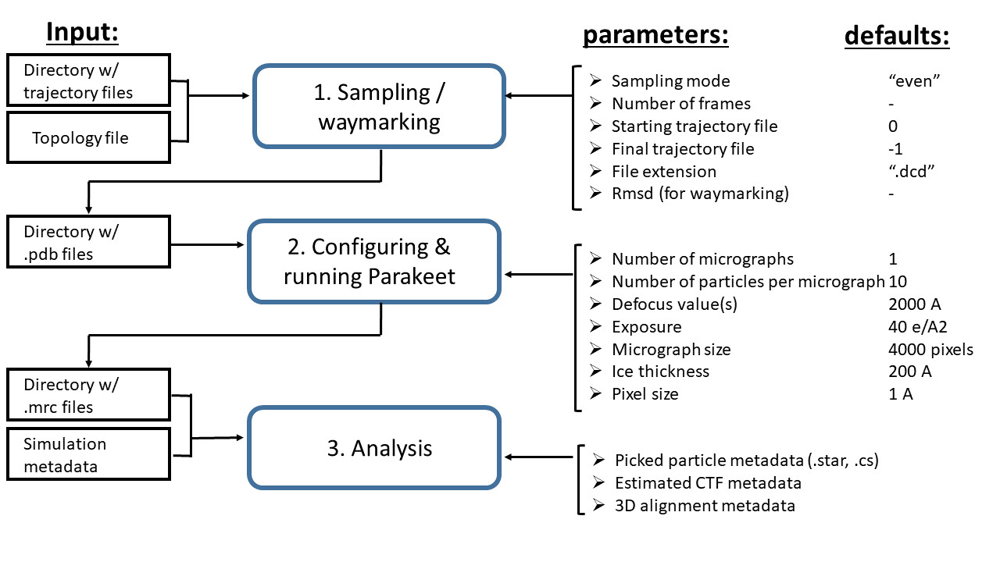

# roodmus

## Utility of the program
The aim of roodmus is to turn an MD trajectory into a set of micrographs that can serve as ground-truth for testing cryo-EM (heterogeneous) reconstruction methods. The core of the micrograph simulation is done using parakeet. The program consists of three modules: 

### 1. Sample pdb/mmcif models from trajectory dataset
Given a directory of trajectory files (in for example .nc or .dcd format) and a topology file (for example a .pdb file), this module saves a selection of frames from the trajectory as .pdb files.

### 2. Generate SPA dataset using Parakeet python API:
Given a directory containing (any) .pdb files, a desired number of images to simulate and a number of molecules per image, this module generates a configuration file to run parakeet and then executes the parakeet simulation. Each micrograph subsamples the .pdb files to the number of molecules to generate, if not enough .pdb files are available, multiple instances of the same file are used. The config file is saved as a .yaml file with the same name as the image it corresponds to.

### 3. Tools to visualise and investigate truth particles 
This molecule can be used to compare the ground truth simulated particles to the output of common reconstruction steps in a cryo-EM processing pipeline. These steps include the particle picking, the CTF estimation and the 3D alignment. At the moment relion .star file and cryosparc .cs file inputs are accepted.

## scope of the project
### minimal
To meet the requirements for a minimal paper, we need to showcase how to turn around 4-5 different MD simulation or other conformation sampling data sets into EM data. Then we can do homogeneous reconstruction and 3D classification to show how one can investigate how different (simple) heterogeneity methods handle specific kinds of data. We can also compare the different steps in the reconstruction pipeline, such as particle picking, CTF estimation and 3D alignment to the known ground truth particle positions, orientations and CTF parameters.

Some results we can include are:
- long RNA transcription complex (DE Shaw simulation, data generated by Joel)
    - homogeneous reconstruction, fitting and refining model into map
    - particle picking, CTF and 3D alignment analysis, also highlighting the need for randomly sampled defocus values
    - Map quality analysis
    - 3D classification to see if the continuous MD simulation can produce several discretely identifiable states
    - CryoDRGN? Could also go into follow-up paper

- DEshaw spike protien trajectories starting in open and closed states
    - a data set that contains different discrete starting states and a continuous distribution of states around each
    - 3D classification to show different conformations, match to the open and closed starting states
    - fit trajectory frames to 3D classes to see if distribution of particles assigned to each class matches the proportion of frames taken from each trajectory
    - pca on trajectory to get different discrete states, compare to 3D classes

- steered MD spike protein simulation
    - homogeneous reconstruction
    - Good target for cryoDRGN

- course-grained MD simulation
    - possibly for later paper

- morphing structure (molecular motion database)
    - no trajectory known
    - large conformational change, unweighted
    - 3D classification
    - homogeneous reconstruction

- show can simulate prefered orientation

- compare reconstruction steps to ground truth (analysis module, can be shown on all data sets mentioned above)
    - particle picking
    - CTF estimation
    - 3D alignment

### extended
investigations into how heterogeneous reconstruction tools handle the simulated data.

## Plan of Action (updated 25/01/203)
- wrapper to drive the program (Joel)
- analysis module: porting the picked particle comparison script from Joel's code
- analysis module: new script to compare 3D alignments to ground-truth particle orientations

# Licensing
Need to figure out what kind of license we want and when/how we need to get it for the repo. May have to use the same licence as parakeet.

# Parakeet Compatibility
Code is currently tested with parakeet commit `024b86ebf55adf737c1b1116b8adbb59ee7db491`. Functionality is expected to be easily extended to the most recent version as of 9/3/23. This may required a small number of Parakeet config variables to be added/modified in the configuration class.

# flow chart of current structure of Roodmus

